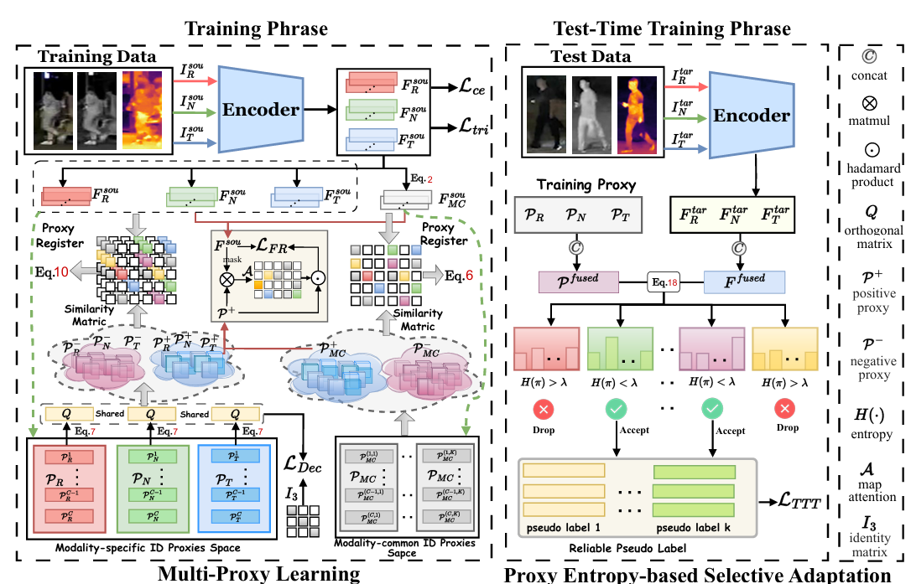
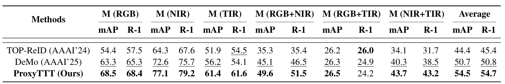
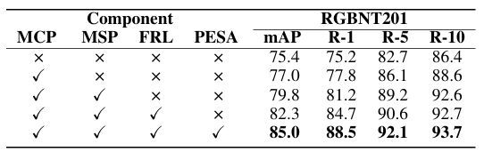
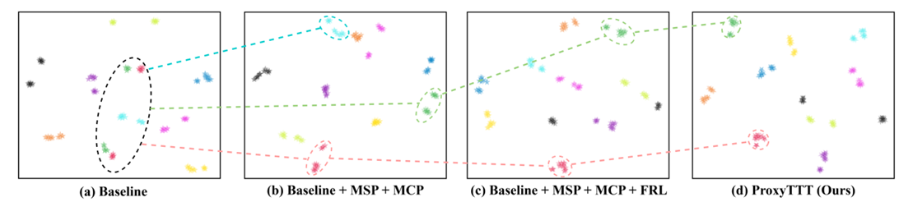
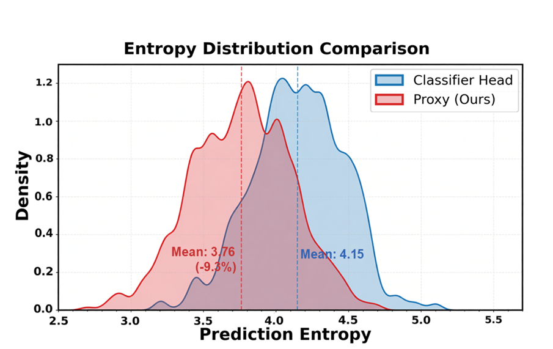

# ProxyTTT: Proxy-driven Test-Time Training for Multi-modal Re-identification




------

**ProxyTTT** is a unified multi-modal object Re-Identification (ReID) framework tailored to address modality/viewpoint discrepancies and domain generalization challenges. By integrating Multi-Proxy Learning (MPL) for robust identity representation alignment and Proxy Entropy-based Selective Adaptation (PESA) for test-time target-domain adaptation, it learns discriminative cross-modal features and mitigates domain shift, achieving state-of-the-art performance on mainstream multi-modal ReID benchmarks.


## News

- We released the **ProxyTTT** codebase ! 

- Great news! Our paper has been accepted to **AAAI 2026**! 🎉

  

## **Results**

#### Multi-Modal Object ReID 


#### Incomplete Multi-Modal Object ReID on RGBNT201



------


## Ablation




## Visualizations

#### T-SNE of RGBNT201.



------

#### Entropy Distribution Comparison.



## **Reproduction**

### Datasets

- [**RGBNT201**](https://pan.baidu.com/s/1i8Yrd4fn2M9l67yyQV0dew?pwd=y4e5)
- [**WMVeID863**]( https://pan.baidu.com/s/1UpFTwqfWEPnSUC-cQEYSFA?pwd=8a2c)
- [**MSVR310**](https://pan.baidu.com/s/1hLoda7hkcDQzTEzro4OXVA?pwd=waxr)
- [**RGBNT100**](https://pan.baidu.com/s/1Ery15UYDHn4bVK67zA6EGQ?pwd=bm9z) 

### Training

```bash
conda create -n ProxyTTT python=3.10.14 -y 
conda activate ProxyTTT
pip install torch==1.13.1+cu117 torchvision==0.14.1+cu117 torchaudio==0.13.1+cu117 --extra-index-url https://download.pytorch.org/whl/cu117
cd (your_path)
pip install -r requirements.txt
python train.py --config_file ./configs/RGBNT201/ProxyTTT.yml
```

### Testing

```bash
python test.py --config_file ./configs/RGBNT201/ProxyTTT.yml
```


#### model pth

|  Dataset  | mAP  | R-1  |                            Model                             |
| :-------: | :--: | :--: | :----------------------------------------------------------: |
| RGBNT201  | 85.0 | 88.5 | [<u>**model**</u>]( https://pan.baidu.com/s/1oY5Ko-8dd6fq_6_keaVbFg?pwd=tvfb ) |
| WMVeID863 | 72.5 | 82.2 | [**<u>model</u>**](https://pan.baidu.com/s/1HypaheCuFfSjfT4tiabA4g?pwd=rx7z) |
| RGBNT100  | 89.3 | 97.7 | <u>**[model](https://pan.baidu.com/s/1POpEW8xgk216S6iVn3uq2Q?pwd=2tad)**</u> |
|  MSVR310  | 63.6 | 72.1 | [<u>**model**</u>]( https://pan.baidu.com/s/1a_FkjehJKul2DN8Eu8U8bQ?pwd=rwfn) |

### Note

This repository is based on [CLIP-ReID](https://github.com/Syliz517/CLIP-ReID). 